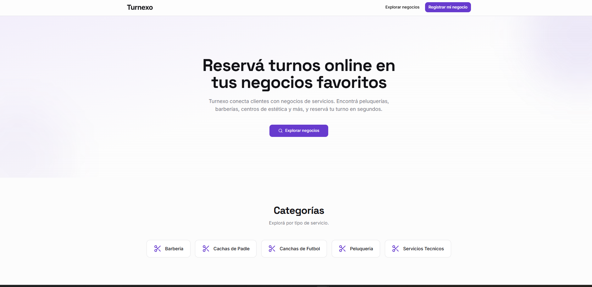

# 📅 Sistema de Turnos SaaS

Aplicación web full stack para la gestión de turnos, desarrollada como proyecto final de la Tecnicatura Universitaria en Programación (UTN).



---

## 🚀 Tecnologías utilizadas

**Frontend**
- React (gestión de estado y componentes)
- JavaScript / HTML / CSS

**Backend**
- Python 3
- FastAPI (API REST)

**Base de datos**
- SQL Server (diseño relacional, consultas optimizadas)

**Herramientas**
- Git / GitHub
- VS Code

---

## ✨ Funcionalidades principales

- Registro y autenticación de usuarios
- Gestión de turnos: creación, modificación y cancelación
- Validaciones de negocio (conflictos de horario, disponibilidad)
- Flujos de estado de turnos (pendiente → confirmado → cancelado)
- API REST documentada con FastAPI / Swagger
- Diseño de base de datos relacional normalizada

---

## 📸 Capturas de pantalla

| Vista principal |


| Gestión de turnos |


## ⚙️ Cómo correr el proyecto localmente

### Requisitos previos
- Python 3.10+
- Node.js 18+
- SQL Server (o instancia local)

### Backend

```bash
# Clonar el repositorio
git clone https://github.com/tu-usuario/sistema-turnos-saas.git
cd sistema-turnos-saas/backend

# Crear entorno virtual
python -m venv venv
source venv/bin/activate  # En Windows: venv\Scripts\activate

# Instalar dependencias
pip install -r requirements.txt

# Configurar variables de entorno
cp .env.example .env
# Editá .env con tu cadena de conexión a SQL Server

# Correr el servidor
uvicorn main:app --reload
```

La API estará disponible en `http://localhost:8000`  
Documentación Swagger: `http://localhost:8000/docs`

### Frontend

```bash
cd ../frontend

# Instalar dependencias
npm install

# Correr la app
npm run dev
```

La app estará disponible en `http://localhost:5173`

---

## 🗂️ Estructura del proyecto

```
sistema-turnos-saas/
├── backend/
│   ├── main.py
│   ├── routers/
│   ├── models/
│   ├── schemas/
│   ├── database.py
│   └── requirements.txt
├── frontend/
│   ├── src/
│   │   ├── components/
│   │   ├── pages/
│   │   └── App.jsx
│   └── package.json
└── README.md
```

## 📖 API — Endpoints principales

| Método | Endpoint | Descripción |
|--------|----------|-------------|
| POST | `/api/usuarios` | Registro de usuario |
| POST | `/api/auth/login` | Login y obtención de token |
| GET | `/api/turnos` | Listar turnos del usuario |
| POST | `/api/turnos` | Crear nuevo turno |
| PUT | `/api/turnos/{turnos_id}` | Modificar turno |
| DELETE | `/api/turnos/{turnos_id}` | Cancelar turno |
| POST | `/api/negocio/complete` | Crear negocio |

---

## 👤 Autor

**Rocco Lavecchia**  
Full Stack Developer — React + FastAPI | Python & SQL

- 📧 roccolavecchia.rl@gmail.com  
- 💼 [LinkedIn](https://www.linkedin.com/in/rocco-lavecchia-58089917a/)  
- 🐙 [GitHub]([https://github.com/tu-usuario](https://github.com/lavecchiarocco))


**Bruno Massoco**  
Developer FullStack - JavaScript - C# - SQL - NodeJs - React - Nextjs
- 📧 brunoo6.massocco@gmail.com
- 💼 [LinkedIn](linkedin.com/in/bruno-massocco-49b113307/)  
- 🐙 [GitHub]([https://github.com/tu-usuario](https://github.com/wyn-code))


## 📄 Licencia

Este proyecto fue desarrollado con fines educativos como proyecto final de carrera en la UTN.
