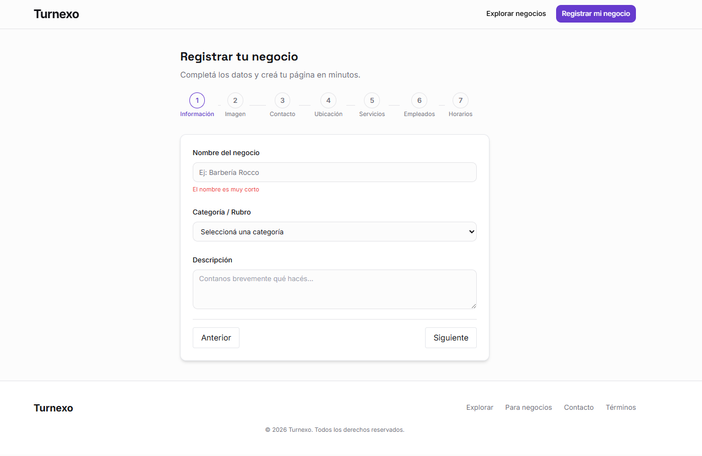

# 📅 Turnogo — Sistema de Turnos SaaS

Aplicación web full stack para la gestión de turnos, desarrollada como proyecto final de la Tecnicatura Universitaria en Programación (UTN).


---

## 🚀 Tecnologías utilizadas

**Frontend**

- React.js & TypeScript
- Gestión de estado y Hooks
- CSS Moderno / Tailwind (si aplica)

**Backend**

- Python 3
- FastAPI (Framework de alto rendimiento)
- SQLAlchemy (ORM)
- Pydantic (Validación de datos)

**Base de datos & Infraestructura**

- PostgreSQL (Supabase)
- Docker & Docker Compose
- Git / GitHub

---

## ✨ Funcionalidades principales

- **Gestión de Usuarios:** Registro, login y perfiles.
- **Gestión de Turnos:** Creación, modificación y cancelación con validación de disponibilidad.
- **Negocios:** Registro de establecimientos y configuración de servicios.
- **API Documentada:** Documentación interactiva completa con Swagger UI.
- **Validaciones:** Lógica de negocio para evitar solapamiento de horarios.

---

## 📸 Capturas de pantalla

| Vista de Negocio                               | Gestión de Turnos                          |
| ---------------------------------------------- | ------------------------------------------ |
|  |  |

---

## 🗂️ Estructura del proyecto

### 🖥️ Backend (FastAPI)

```
app/
├── core/           # Configuración, seguridad y constantes
├── db/             # Sesión de base de datos y conexión
├── models/         # Modelos de la base de datos (SQLAlchemy)
├── routers/        # Definición de rutas y endpoints
├── schemas/        # Modelos de datos para validación (Pydantic)
├── services/       # Lógica de negocio y servicios externos
└── main.py         # Punto de entrada de la aplicación
```

### 🎨 Frontend (React + TS)

```
src/
├── api/            # Configuración de Axios/Fetch
├── components/     # Componentes de UI reutilizables
├── contexts/       # Manejo de estados globales
├── hooks/          # Lógica de componentes extraída
├── pages/          # Vistas principales de la app
├── services/       # Integración con el backend
└── types/          # Definiciones de interfaces TypeScript
```

## 📖 API — Endpoints principales

| Método | Endpoint                  | Descripción                |
| ------ | ------------------------- | -------------------------- |
| POST   | `/api/usuarios`           | Registro de usuario        |
| POST   | `/api/auth/login`         | Login y obtención de token |
| GET    | `/api/turnos`             | Listar turnos del usuario  |
| POST   | `/api/turnos`             | Crear nuevo turno          |
| PUT    | `/api/turnos/{turnos_id}` | Modificar turno            |
| DELETE | `/api/turnos/{turnos_id}` | Cancelar turno             |
| POST   | `/api/negocio/complete`   | Crear negocio              |

---

## 👤 Autor

Rocco Lavecchia Full Stack Developer

- 📧 roccolavecchia.rl@gmail.com
- 💼 [LinkedIn](https://www.linkedin.com/in/rocco-lavecchia-58089917a/)
- 🐙 [GitHub](<[https://github.com/tu-usuario](https://github.com/lavecchiarocco)>)

Bruno Massoco Full Stack Developer

- 📧 brunoo6.massocco@gmail.com
- 💼 [LinkedIn](linkedin.com/in/bruno-massocco-49b113307/)
- 🐙 [GitHub](<[https://github.com/tu-usuario](https://github.com/wyn-code)>)

📄 Licencia
Este proyecto fue desarrollado con fines educativos para la UTN.
