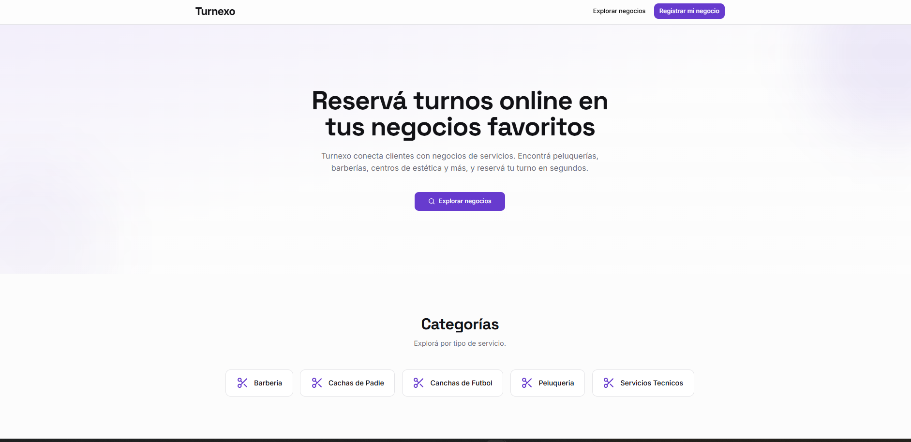
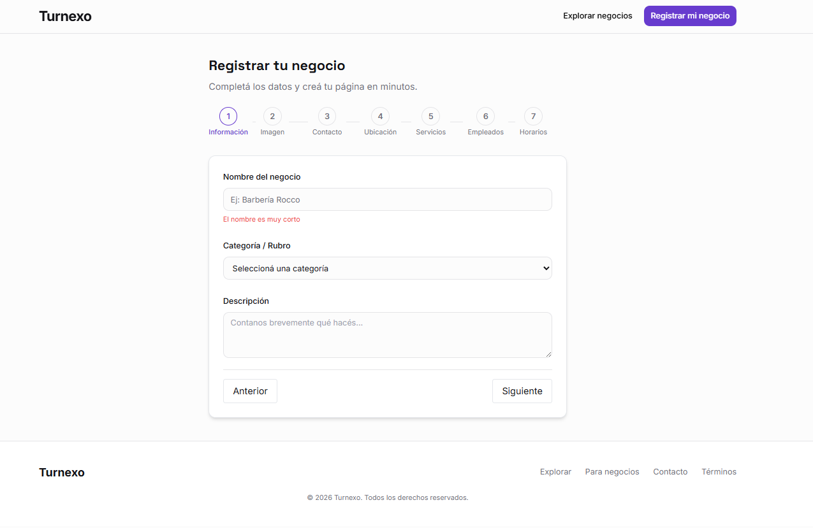

# 📅 Turnogo — Sistema de Turnos SaaS

Aplicación web full stack para la gestión de turnos, desarrollada como proyecto final de la Tecnicatura Universitaria en Programación (UTN).



---

## 🚀 Tecnologías utilizadas

**Frontend**

- React.js & TypeScript
- Gestión de estado y Hooks
- CSS Moderno / Tailwind (si aplica)

**Backend**

- Python 3
- FastAPI (Framework de alto rendimiento)
- SQLAlchemy (ORM)
- Pydantic (Validación de datos)

**Base de datos & Infraestructura**

- PostgreSQL (Supabase)
- Docker & Docker Compose
- Git / GitHub

---

## ✨ Funcionalidades principales

- **Gestión de Usuarios:** Registro, login y perfiles.
- **Gestión de Turnos:** Creación, modificación y cancelación con validación de disponibilidad.
- **Negocios:** Registro de establecimientos y configuración de servicios.
- **API Documentada:** Documentación interactiva completa con Swagger UI.
- **Validaciones:** Lógica de negocio para evitar solapamiento de horarios.

---

## 📸 Capturas de pantalla

| Vista de Negocio                               | Gestión de Turnos                          |
| ---------------------------------------------- | ------------------------------------------ |
|  |  |

---

## 🗂️ Estructura del proyecto

### 🖥️ Backend (FastAPI)

```
app/
├── core/           # Configuración, seguridad y constantes
├── db/             # Sesión de base de datos y conexión
├── models/         # Modelos de la base de datos (SQLAlchemy)
├── routers/        # Definición de rutas y endpoints
├── schemas/        # Modelos de datos para validación (Pydantic)
├── services/       # Lógica de negocio y servicios externos
└── main.py         # Punto de entrada de la aplicación
```

### 🎨 Frontend (React + TS)

```
src/
├── api/            # Configuración de Axios/Fetch
├── components/     # Componentes de UI reutilizables
├── contexts/       # Manejo de estados globales
├── hooks/          # Lógica de componentes extraída
├── pages/          # Vistas principales de la app
├── services/       # Integración con el backend
└── types/          # Definiciones de interfaces TypeScript
```

## 📖 API — Endpoints principales

| Método | Endpoint                  | Descripción                |
| ------ | ------------------------- | -------------------------- |
| POST   | `/api/usuarios`           | Registro de usuario        |
| POST   | `/api/auth/login`         | Login y obtención de token |
| GET    | `/api/turnos`             | Listar turnos del usuario  |
| POST   | `/api/turnos`             | Crear nuevo turno          |
| PUT    | `/api/turnos/{turnos_id}` | Modificar turno            |
| DELETE | `/api/turnos/{turnos_id}` | Cancelar turno             |
| POST   | `/api/negocio/complete`   | Crear negocio              |

### Categorías jerárquicas

`categorias.parent_id` (nulo = raíz) permite árboles como _Deportes → Fútbol, Pádel…_.
Un negocio puede colgar de una raíz o de una sub-categoría.

| Método | Endpoint                               | Descripción                                                                 |
| ------ | -------------------------------------- | --------------------------------------------------------------------------- |
| GET    | `/api/categorias/tree`                 | Árbol completo: raíces con `children` anidados (público)                    |
| POST   | `/api/categorias/`                     | Crear (admin); acepta `parent_id`                                           |
| PUT    | `/api/categorias/{id}`                 | Editar / mover (admin); rechaza `parent_id` inexistente o que forme un ciclo |
| DELETE | `/api/categorias/{id}`                 | Borrar (admin); 409 si tiene sub-categorías                                 |

### Espacios (antes "canchas")

Recurso reservable alternativo al empleado. Un negocio puede tener **varios** espacios.

| Método | Endpoint                               | Descripción                                          |
| ------ | -------------------------------------- | ---------------------------------------------------- |
| GET    | `/api/negocios/{id_negocio}/espacios`  | Espacios del negocio (público; `?incluir_inactivas=true`) |
| POST   | `/api/espacios`                        | Crear (`id_negocio`, `nombre`, `numero?`, `descripcion?`) |
| PUT    | `/api/espacios/{id_espacio}`           | Editar                                               |
| DELETE | `/api/espacios/{id_espacio}`           | Baja lógica (`activo=false`)                          |

Las rutas `/api/canchas/...`, el campo `id_cancha` (en requests y responses) y el
parámetro `?id_cancha=` siguen funcionando como alias **deprecados**.

### Turnos: empleado XOR espacio

- Un turno reserva un `id_empleado` **o** un `id_espacio`, nunca ambos (`400`; además
  `chk_turno_no_empleado_y_espacio` en la base).
- Si el negocio tiene espacios activos (multi-espacio), el turno **debe** indicar `id_espacio`.
- Negocios de servicios (sin espacios) siguen usando `id_empleado` como siempre.
- El solapamiento se controla por recurso: `ex_turno_no_solapa_empleado` y
  `ex_turno_no_solapa_espacio` (`409`).
- `PUT /api/turnos/{id}` con `id_espacio` (o `id_empleado`) **reemplaza** el recurso anterior.

| Método | Endpoint                                                                   | Descripción                                                                                   |
| ------ | -------------------------------------------------------------------------- | --------------------------------------------------------------------------------------------- |
| GET    | `/api/turnos/disponibles?categoria_padre={id}&fecha={YYYY-MM-DD}&estado={id}` | Turnos de negocios de esa categoría (y sub-categorías) con `recurso` `{tipo, id, nombre}`; público, sin datos del cliente |
| GET    | `/api/turnos/disponibilidad?id_negocio=&desde=&hasta=&id_espacio=`         | Slots ocupados de un negocio/recurso                                                          |

### Migraciones y tests

- Alembic: `20260930000100` (parent_id), `…0200` (cancha→espacio), `…0300` (turno); todas
  con `downgrade()`. Espejo SQL en `supabase/migrations/20260930*.sql`.
- `tests/test_migrations.py` corre las migraciones reales sobre PostgreSQL y se activa con
  `TEST_POSTGRES_URL=postgresql+psycopg2://user@host/db_descartable` (se saltea si falta).
  Requiere `pip install alembic`.

---

## 👤 Autor

Rocco Lavecchia Full Stack Developer

- 📧 roccolavecchia.rl@gmail.com
- 💼 [LinkedIn](https://www.linkedin.com/in/rocco-lavecchia-58089917a/)
- 🐙 [GitHub](<[https://github.com/tu-usuario](https://github.com/lavecchiarocco)>)

Bruno Massoco Full Stack Developer

- 📧 brunoo6.massocco@gmail.com
- 💼 [LinkedIn](linkedin.com/in/bruno-massocco-49b113307/)
- 🐙 [GitHub](<[https://github.com/tu-usuario](https://github.com/wyn-code)>)

📄 Licencia
Este proyecto fue desarrollado con fines educativos para la UTN.
